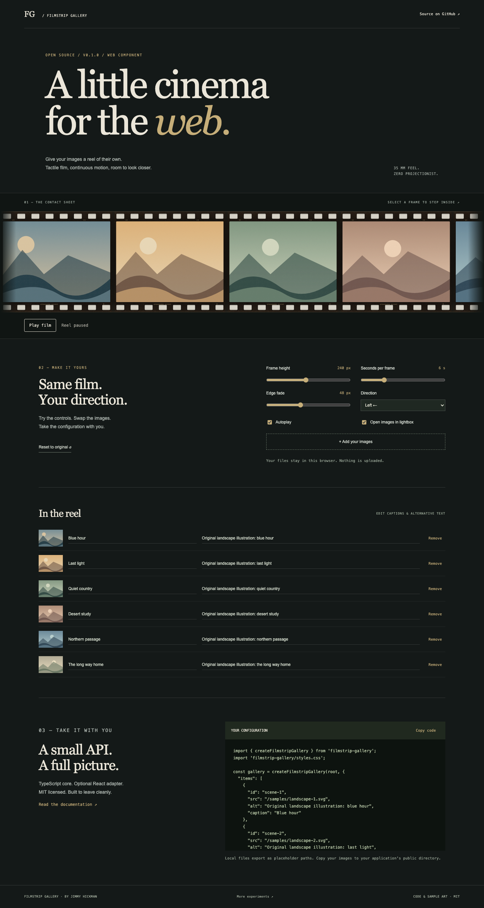
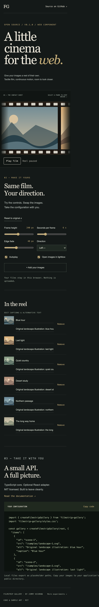

# Filmstrip Gallery

[](docs/GETTING_STARTED.md)
[](package.json)
[](docs/API.md)
[](package.json)
[](package.json)
[](LICENSE)
[](https://hickman.biz/portfolio/filmstrip-gallery)

A little cinema for the web. A framework-neutral TypeScript image gallery with textured film frames, seamless GSAP motion, a keyboard-accessible lightbox, and an optional React adapter.

[Live playground](https://hickman.biz/portfolio/filmstrip-gallery) · [API](docs/API.md) · [Validation](docs/VALIDATION.md)



## Run locally

Node **22.18+** and npm. No accounts, secrets, private registry, or sibling checkout required.

```sh
git clone https://github.com/JimmyJammed/filmstrip-gallery-web.git
cd filmstrip-gallery-web
npm ci
npm run dev
```

## Use the component

Download `filmstrip-gallery-0.1.0.tgz` from the [GitHub release](https://github.com/JimmyJammed/filmstrip-gallery-web/releases/tag/v0.1.0), or run `npm run pack:library`.

```sh
npm install ./filmstrip-gallery-0.1.0.tgz
```

```ts
import { createFilmstripGallery } from 'filmstrip-gallery';
import 'filmstrip-gallery/styles.css';

const gallery = createFilmstripGallery(document.querySelector('#gallery')!, {
  items: [{ id: 'coast', src: '/coast.jpg', alt: 'A quiet coast at dusk' }],
});
// When the host view unmounts:
gallery.destroy();
```

React 18/19: import `FilmstripGallery` from `filmstrip-gallery/react`, pass `options`, and import the stylesheet once. React is not required by the core. Public npm publication is deferred; the package badge reads the repository version.

## Inside

- Continuous film loop with configurable pace, direction, size, and edge fade.
- Manual scrolling for reduced motion and Save-Data; a visible pause control for autoplay.
- Native dialog with captions, counter, previous/next, Escape, and focus restoration.
- Multiple independent instances and explicit cleanup, including React Strict Mode.
- Local image previews, caption/alt editing, configuration export, and reset.
- Original neutral landscape artwork bundled with the demo.

## Documentation

[Getting started](docs/GETTING_STARTED.md) · [API](docs/API.md) · [Customization](docs/CUSTOMIZATION.md) · [Accessibility](docs/ACCESSIBILITY.md) · [Architecture](docs/ARCHITECTURE.md) · [Deployment](docs/DEPLOYMENT.md) · [Troubleshooting](docs/TROUBLESHOOTING.md) · [Validation](docs/VALIDATION.md) · [Contributing](CONTRIBUTING.md) · [Changelog](CHANGELOG.md)

<details><summary>Mobile preview</summary>



</details>

## Related projects

[Dossier Folders](https://github.com/JimmyJammed/dossier-folders-web) · [Polaroid Gallery](https://github.com/JimmyJammed/polaroid-gallery-web) · [Interactive Coming Soon](https://github.com/JimmyJammed/interactive-coming-soon-web)

## License

Original code and sample art: MIT. Created by Jimmy Hickman. Copyright Falcon Forged Ventures LLC. Dependencies retain their own licenses, including GSAP's separate license. See [LICENSE](LICENSE) and [third-party notices](THIRD_PARTY_LICENSES.md). This release contains no Stranger Court event photos or branding.
